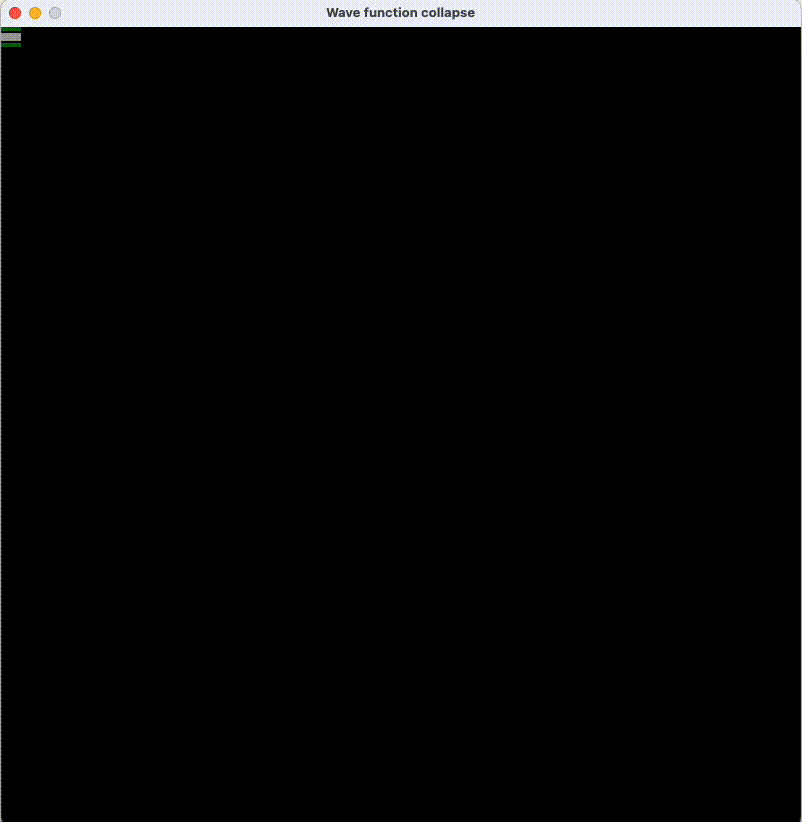

# Wave Function Collpase
This is an image generator based on input tiles that have certain border rules.
You can read more about it here:
[Wikipedia page](https://en.wikipedia.org/wiki/Wave_function_collapse)

And visit GitHub repo about it:
[WFC github page](https://github.com/mxgmn/WaveFunctionCollapse)

## Result demo with backtracking
GIF presented below is a result of final version of the project with implemented backtracking for 14 tiles in 40x40 grid.

## First working result - no backtracking
Used tiles:  

  
After loading tiles with boundaries, algorithm computes all possible rotations. 
Example result for 5x5 grid:

## Second example - no backtracking
Used tiles:  

  
After loading tiles with boundaries, algorithm computes all possible rotations. 
Example result for 10x10 grid:

## Third example - with implemented backtracking
Backtracking done recursivly by solve function  
Used tiles:  

  
After loading tiles with boundaries, algorithm computes all possible rotations. 
Example result for 40x40 grid:

